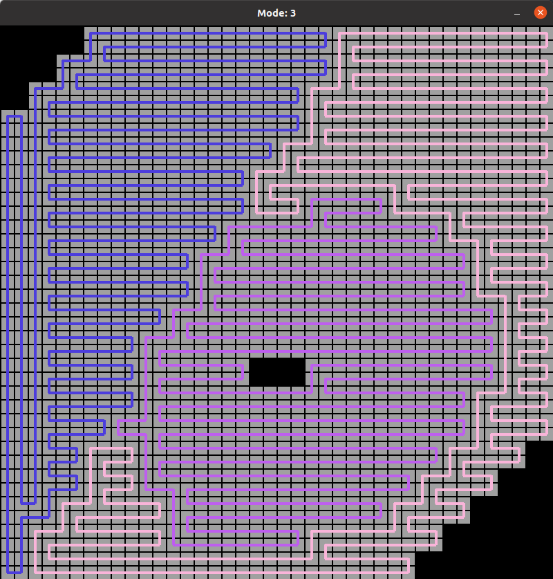

# DARP: Divide Areas Algorithm for Optimal Multi-Robot Coverage Path Planning

## Motivation

This project deals with the path planning problem of a team of mobile robots, in order to cover an area of interest, with prior-defined obstacles.

DARP algorithm divides the terrain into a number of equal areas each corresponding to a specific robot, so as to guarantee complete coverage, non-backtracking solution, minimum coverage path, while at the same time does not need any preparatory stage.

### But how does this algorithm work?

In essence, the DARP algorithm follows a cyclic coordinate descent optimization scheme updating each robots’ territory separately but towards achieving the overall mCPP objectives.

<p align="center">
  
</p>


After the desired area division is achieved, we use Spanning Tree Coverage algorithm to produce the optimal path for each robot, in order to achieve full coverage of the area of interest.


<p align="center">
  
</p>


## Requirements

This project was created using:

* Python version >= 3.6.14
* OpenCV version >= 4.5.2.54
* Pygame version >= 2.0.1
* Scipy version >= 1.7.1

## Installation and Running

* To install the application, use:
```
git clone https://github.com/alice-st/DARP-Python.git
cd DARP-Python
./Dependencies.sh DARP
source DARP/bin/activate
```

* To run the application, use:

```
python3 darpinPoly.py
```

## Usage
* To modify the Grid Dimensions, use:
```
python3 darpinPoly.py -grid x y

```
where x, y are the desired rows and columns of the Grid respectively (default: 10, 10).

* To modify the number of Robots and their Initial Positions, use:

```
python3 darpinPoly.py -in_pos a b c

```
where a, b, c, are the cells' numbers in the Grid (default: 1, 3, 9) (row=0,column=0 --> cell=0, row=0,column=1 --> cell=1 etc.)

* To assign different portions to each Robot (not Equal), use:

```
python3 darpinPoly.py -nep -portions d e f

```

where d e f are the portions assigned to Robots a, b and c respectively. Their sum should be equal to 1. (default: 0.2, 0.3, 0.5)

* To use different positions for the obstacles in the Grid, use:

```
python3 darpinPoly.py -obs_pos o1 o2 o3
```

where o1 o2 and o3 are the positions of the obstacles in the Grid. Obstacle positions should not overlap with Robots' initial positions. (default: 5, 6, 7) (row=0,column=0 --> cell=1, row=0,column=1 --> cell=2 etc.)

* To visualize the results, use:

```
python3 darpinPoly.py -vis
```

# Results

Using a 20*20 Grid area, three robots with initial positions 10, 55 and 174 and Equal portions of the Grid shared between the robots, we obtained the following results:

## Assignment Matrix

<p align="center">
  
</p>

## STC paths for each robot, ensuring complete area coverage

### Mode = 0 (connection on bottom between the side of the branches of the MST)

<p align="center">
  
</p>

### Mode = 1 (connection on top between the side of the branches of the MST)

<p align="center">
  
</p>

### Mode = 2 (connection on right between the side of the branches of the MST)

<p align="center">
  
</p>

### Mode = 3 (connection on left between the side of the branches of the MST)

<p align="center">
  
</p>

# Extra Material

Paper: [Zenodo](https://zenodo.org/record/2591050#.YTCvBVtRVH6)

Medium: [Medium](https://medium.com/@athanasios.kapoutsis/darp-divide-areas-algorithm-for-optimal-multi-robot-coverage-path-planning-2fed77b990a3)

GitHub repositories: [Java](https://github.com/athakapo/DARP)

GUI demo: [YouTube](https://www.youtube.com/watch?v=LrGfvma41Ak)

ROS integration: [Wiki](http://wiki.ros.org/area_division)


# Cite as

```
@article{kapoutsisdarp,
  title={DARP: Divide Areas Algorithm for Optimal Multi-Robot Coverage Path Planning},
  author={Kapoutsis, Athanasios Ch and Chatzichristofis, Savvas A and Kosmatopoulos, Elias B},
  journal={Journal of Intelligent \& Robotic Systems},
  pages={1--18},
  publisher={Springer}
}
```
