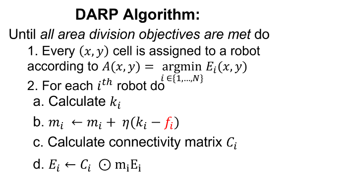
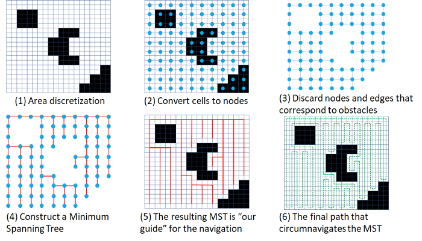
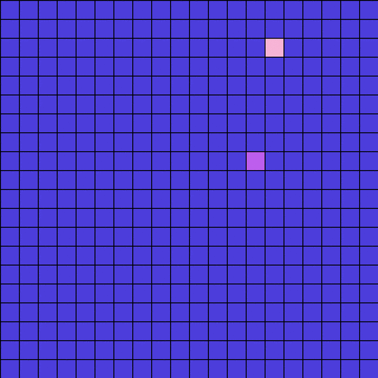
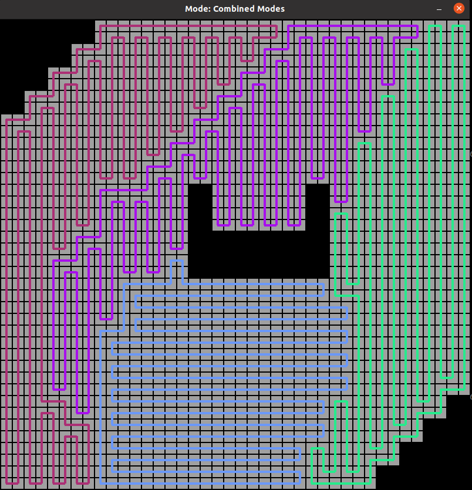

# DARP: Divide Areas Algorithm for Optimal Multi-Robot Coverage Path Planning

## Motivation

This project deals with the path planning problem of a team of mobile robots, in order to cover an area of interest, with prior-defined obstacles.

DARP algorithm divides the terrain into a number of equal areas each corresponding to a specific robot, so as to guarantee complete coverage, non-backtracking solution, minimum coverage path, while at the same time does not need any preparatory stage.

### But how does this algorithm work?

In essence, the DARP algorithm follows a cyclic coordinate descent optimization scheme updating each robots’ territory separately but towards achieving the overall multi-robot Coverage Path Planning (mCPP) objectives.

<p align="center">
  
</p>


After the desired area division is achieved, we use [Spanning Tree Coverage (STC) algorithm](https://citeseerx.ist.psu.edu/viewdoc/download?doi=10.1.1.479.5125&rep=rep1&type=pdf#:~:text=The%20algorithm%2C%20called%20Spanning%20Tree,covering%20every%20point%20precisely%20once.) to produce the optimal path for each robot, in order to achieve full coverage of the area of interest.


<p align="center">
  
</p>


## Requirements

This project was created using:

* Python version >= 3.6.14
* OpenCV version >= 4.5.2.54
* Pygame version >= 2.0.1
* Scipy version >= 1.7.1
* nose == 1.3.7 
* scikit-learn

## Installation and Running

#### To install the application, use:
```
git clone https://github.com/alice-st/DARP-Python.git
cd DARP
./Dependencies.sh DARP
source DARP/bin/activate
```

#### To run the application, use:

```
python3 multiRobotPathPlanner.py
```

## Usage

By default, without defining any parameters, the *multiRobotPathPlanner* is going to run for the following setup:

<p align="center">
  
</p>
where the red, green and purple cells denote the initial positions of the 3 robots respectively and the black cells denote the environments obstacles. 

To define specific parameters please use the instructions below:

#### To modify the Grid Dimensions, use:
```
python3 multiRobotPathPlanner.py -grid x y

```
where x, y are the desired rows and columns of the Grid respectively (default: 10, 10).

#### To modify the number of Robots and their Initial Positions, use:

```
python3 multiRobotPathPlanner.py -in_pos a b c

```
where a, b, c, are the cells' numbers in the Grid (default: 0, 3, 9) (row=0,column=0 --> cell=0, row=0,column=1 --> cell=1 etc.)

#### To assign different portions to each Robot (not Equal), use:


```
python3 multiRobotPathPlanner.py -nep -portions p_a p_b p_c

```

where p_a p_b p_c are the portions assigned to Robots a, b and c respectively. Their sum should be equal to 1. (default: 0.2, 0.3, 0.5)

If -nep is activated (set to True), the algorithm runs for not equal territories with 20%, 30% and 50% coverage per robot. Otherwise, the algorithm runs for equal territories with 33,33% coverage per robot. 


#### To use different positions for the obstacles in the Grid, use:

```
python3 multiRobotPathPlanner.py -obs_pos o1 o2 o3
```

where o1 o2 and o3 are the positions of the obstacles in the Grid. Obstacle positions should not overlap with Robots' initial positions. (default: 5, 6, 7) (row=0,column=0 --> cell=0, row=0,column=1 --> cell=1 etc.)

#### To visualize the results, use:

```
python3 multiRobotPathPlanner.py -vis
```


#### To run the Unittests use:

```
nosetests --nocapture mainUnitTest.py
```

#### Demo example:
 
 ```
python3 multiRobotPathPlanner.py -vis -nep -obs_pos 10 11 12 21 22 23 33 34 35 45 46 47 57 -in_pos 0 99 32 -portions 0.7 0.2 0.1
```

##  Example execution

Using a 20x20 Grid area, four robots with initial positions 10, 32, 99 and 250 and Equal portions of the Grid shared between the robots, we obtained the following results:

### Assignment Matrix

<p align="center">
  
</p>

### Final coverage paths for all robots

For each robot path has been utilized the mode that results in the minimum number of turns to completely cover its respective sub-region.

<p align="center">
  
</p>

## Extra Material

Paper: [Zenodo](https://zenodo.org/record/2591050#.YTCvBVtRVH6)

Medium: [Medium](https://medium.com/@athanasios.kapoutsis/darp-divide-areas-algorithm-for-optimal-multi-robot-coverage-path-planning-2fed77b990a3)

GitHub repositories: [Java](https://github.com/athakapo/DARP)

GUI demo: [YouTube](https://www.youtube.com/watch?v=LrGfvma41Ak)

ROS integration: [Wiki](http://wiki.ros.org/area_division)


## Cite as

```
@article{kapoutsisdarp,
  title={DARP: Divide Areas Algorithm for Optimal Multi-Robot Coverage Path Planning},
  author={Kapoutsis, Athanasios Ch and Chatzichristofis, Savvas A and Kosmatopoulos, Elias B},
  journal={Journal of Intelligent \& Robotic Systems},
  pages={1--18},
  publisher={Springer}
}
```
